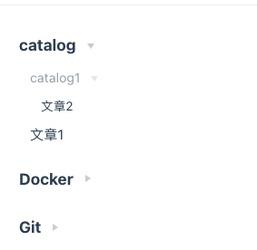

# Vuepress Plugin Easy Sidebar

## 介绍（Introduction）

> 该插件可以根据目录结构自动生成侧边栏。支持 vuepress 版本为 v1.x

例如博客目录如下时：

```md
docs
├─ server
│ |-- catalog
| | |-- catalog1
| | | |-- 文章 2.md
| | |-- 文章 1.md
| |-- docker
| |-- git
```

生成目录效果如下：

> 

## 安装（Install）

```
npm install -D vuepress-plugin-easy-sidebar
```

## 使用（Usage）

```js
module.exports = {
  plugins: [["vuepress-plugin-easy-sidebar", {}]],
};
```
